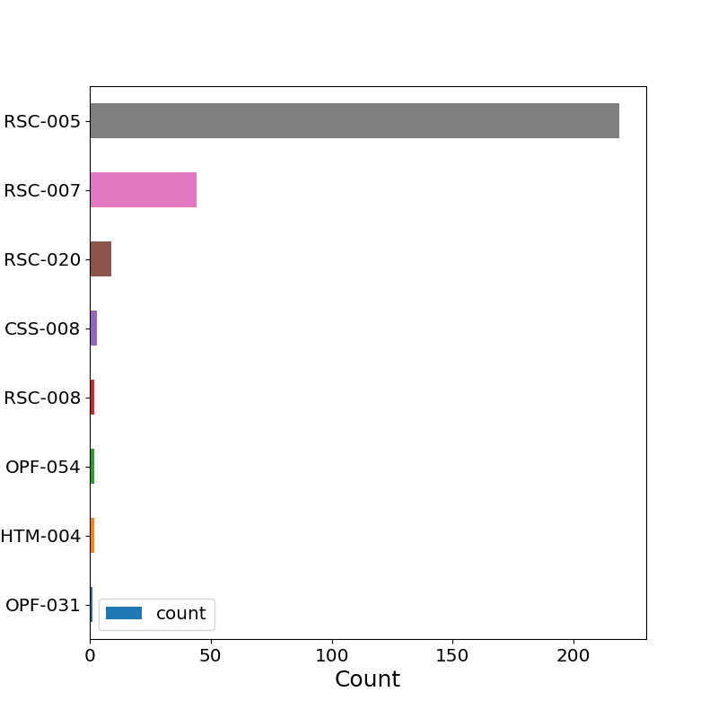
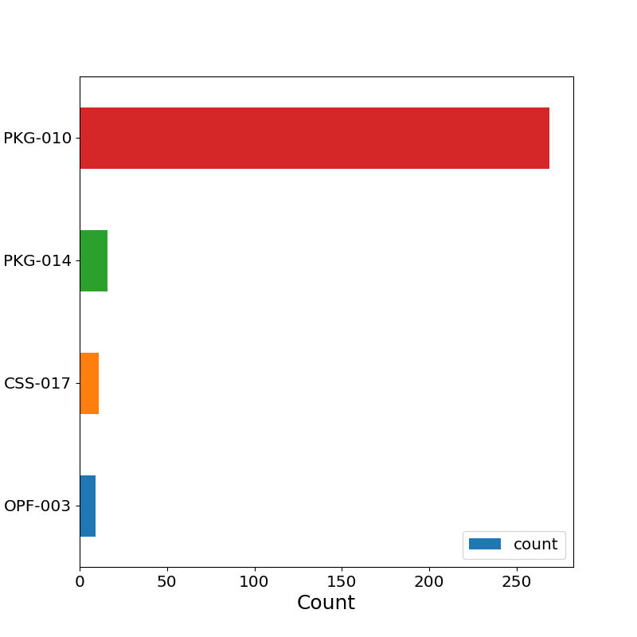

# EPUB analysis report

## Summary

|                                 |   Count | % of all EPUBs   |
|:--------------------------------|--------:|:-----------------|
| EPUBs                           |    8077 |                  |
| EPUBs with errors               |    1567 | 19.4             |
| EPUBs with warnings             |    1336 | 16.54            |
| EPUBs with errors or warnings   |    2270 | 28.1             |
| EPUBs with less than 1000 words |     305 | 3.78             |

## EPUB versions

| epubVersion   |   Count |   % of all EPUBs |
|:--------------|--------:|-----------------:|
| 2.0.1         |    7862 |            97.34 |
| 3.0.1         |     215 |             2.66 |

## Frequency of validation errors

| Code    | Description                                                                                                         |   Count |   % of all EPUBs |
|:--------|:--------------------------------------------------------------------------------------------------------------------|--------:|-----------------:|
| RSC-005 | Error while parsing file: %1$s                                                                                      |     591 |             7.32 |
| RSC-008 | Referenced resource '%1$s' is not declared in the OPF manifest.                                                     |     416 |             5.15 |
| OPF-054 | Date value '%1$s' is not valid as per http://www.w3.org/TR/NOTE-datetime:%2$s.                                      |     288 |             3.57 |
| OPF-032 | Guide references '%1$s' which is not a valid 'OPS Content Document'.                                                |     160 |             1.98 |
| CSS-008 | An error occurred while parsing the CSS: %1$s.                                                                      |     141 |             1.75 |
| HTM-009 | The DOCTYPE provided is obsolete or irregular and can be removed.                                                   |     105 |             1.3  |
| OPF-050 | TOC attribute references resource with non-NCX mime type; 'application/x-dtbncx+xml' is expected.                   |      98 |             1.21 |
| RSC-007 | Referenced resource '%1$s' could not be found in the EPUB.                                                          |      76 |             0.94 |
| HTM-004 | Irregular DOCTYPE: found '%1$s', expected '%2$s'.                                                                   |      63 |             0.78 |
| RSC-020 | '%1$s' is not a valid URI.                                                                                          |      56 |             0.69 |
| HTM-001 | Any publication resource that is an XML-based media type must be a valid XML 1.0 document. XML version found: %1$s. |      30 |             0.37 |
| OPF-052 | Role value '%1$s' is not valid.                                                                                     |      23 |             0.28 |
| OPF-031 | File listed in reference element in guide was not declared in OPF manifest: %1$s.                                   |      11 |             0.14 |
| OPF-034 | The spine contains multiple references to the manifest item with id '%1$s'.                                         |       5 |             0.06 |
| PKG-007 | Mimetype file should only contain the string 'application/epub+zip' and should not be compressed.                   |       4 |             0.05 |
| HTM-046 | Fixed format item has no viewport defined.                                                                          |       1 |             0.01 |
| OPF-073 | External identifiers must not appear in the document type declaration.                                              |       1 |             0.01 |
| NCX-002 | toc attribute was not found on the spine element.                                                                   |       1 |             0.01 |

## Frequency of validation warnings

| Code     | Description                                                                                            |   Count |   % of all EPUBs |
|:---------|:-------------------------------------------------------------------------------------------------------|--------:|-----------------:|
| PKG-010  | Filename contains spaces, therefore URI escaping is necessary. Consider removing spaces from filename. |     859 |            10.64 |
| OPF-003  | Item '%1$s' exists in the EPUB, but is not declared in the OPF manifest.                               |     433 |             5.36 |
| CSS-017  | CSS selector specifies absolute position.                                                              |     184 |             2.28 |
| HTM-014  | Invalid file extension for HTML file, expecting (html, htm or xhtml).                                  |      24 |             0.3  |
| PKG-014  | The EPUB contains empty directory '%1$s'.                                                              |      17 |             0.21 |
| OPF-055  | %1$s tag is empty.                                                                                     |       9 |             0.11 |
| HTM-014a | XHTML Content Document file name '%1$s' should have the extension '.xhtml'.                            |       7 |             0.09 |
| PKG-012  | File name contains the following non-ascii characters: %1$s. Consider changing the filename.           |       5 |             0.06 |
| CSS-006  | CSS position:fixed property should not be used in EPUBs.                                               |       1 |             0.01 |

## Detailed statistics

### All EPUBs

|       |    noErrors |   noWarnings |   wordCount |
|:------|------------:|-------------:|------------:|
| count | 8077        |  8077        |      8077   |
| mean  |    0.256283 |     0.190541 |     68291.2 |
| std   |    0.571692 |     0.453886 |     53316.5 |
| min   |    0        |     0        |         0   |
| 25%   |    0        |     0        |     32100   |
| 50%   |    0        |     0        |     59506   |
| 75%   |    0        |     0        |     92629   |
| max   |    5        |     3        |    606533   |

### EPUBs with errors

|       |    noErrors |   noWarnings |   wordCount |
|:------|------------:|-------------:|------------:|
| count | 1567        |  1567        |      1567   |
| mean  |    1.321    |     0.522017 |     75689.6 |
| std   |    0.527373 |     0.701663 |     53922   |
| min   |    1        |     0        |         0   |
| 25%   |    1        |     0        |     41452   |
| 50%   |    1        |     0        |     68594   |
| 75%   |    2        |     1        |     96481   |
| max   |    5        |     3        |    606533   |

### EPUBs with warnings

|       |    noErrors |   noWarnings |   wordCount |
|:------|------------:|-------------:|------------:|
| count | 1336        |  1336        |      1336   |
| mean  |    0.712575 |     1.15195  |     65321   |
| std   |    0.842517 |     0.371408 |     54989.8 |
| min   |    0        |     1        |         0   |
| 25%   |    0        |     1        |     27475.8 |
| 50%   |    0        |     1        |     55474   |
| 75%   |    1        |     1        |     94484.2 |
| max   |    5        |     3        |    446298   |

### EPUBs with errors or warnings

|       |    noErrors |   noWarnings |   wordCount |
|:------|------------:|-------------:|------------:|
| count | 2270        |  2270        |      2270   |
| mean  |    0.911894 |     0.677974 |     70058   |
| std   |    0.75178  |     0.634542 |     54981.3 |
| min   |    0        |     0        |         0   |
| 25%   |    0        |     0        |     33130   |
| 50%   |    1        |     1        |     62695   |
| 75%   |    1        |     1        |     94935.8 |
| max   |    5        |     3        |    606533   |

### EPUBs with less than 1000 words

|       |   noErrors |   noWarnings |   wordCount |
|:------|-----------:|-------------:|------------:|
| count | 305        |   305        |     305     |
| mean  |   0.104918 |     0.55082  |     222.839 |
| std   |   0.374529 |     0.504787 |     233.306 |
| min   |   0        |     0        |       0     |
| 25%   |   0        |     0        |      52     |
| 50%   |   0        |     1        |     178     |
| 75%   |   0        |     1        |     312     |
| max   |   4        |     2        |     994     |
