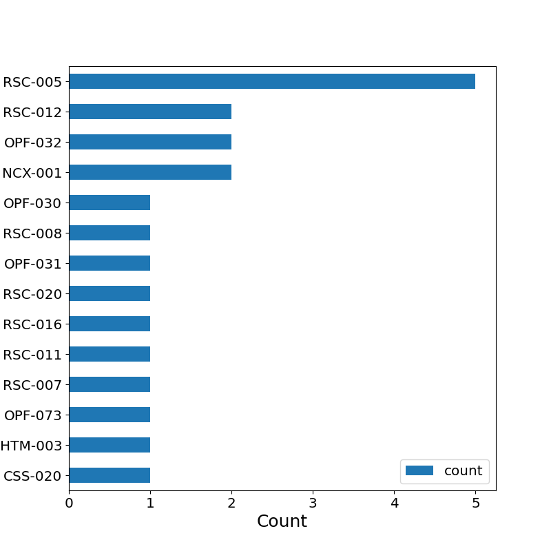
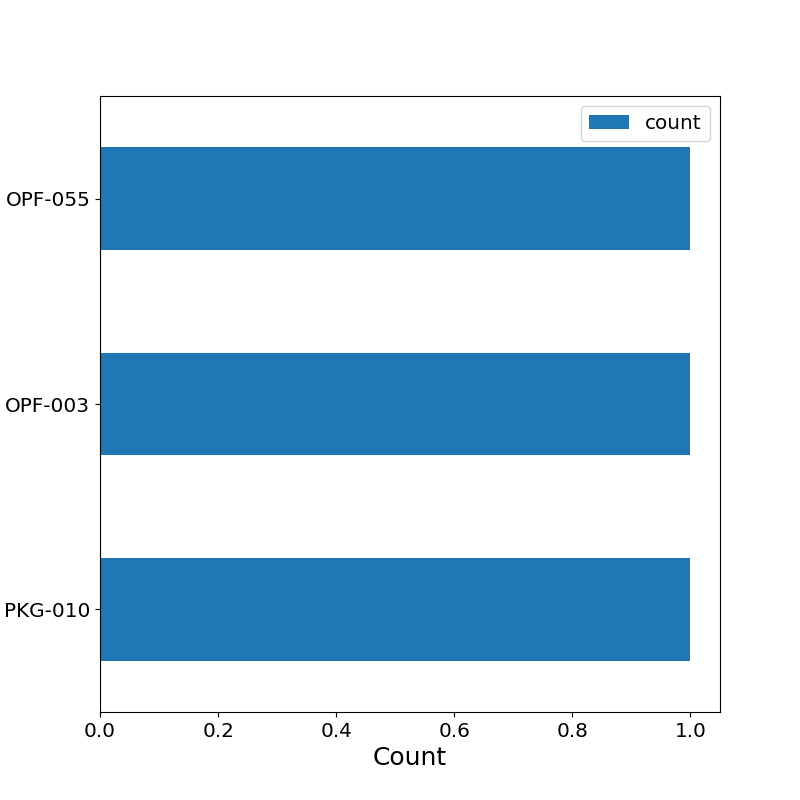

# EPUB analysis report

Report generated: 2022-11-07 15:50:28

Input file: ./example.csv

## Summary

|                                 |   Count | % of all EPUBs   |
|:--------------------------------|--------:|:-----------------|
| EPUBs                           |      12 |                  |
| EPUBs with errors               |       7 | 58.33            |
| EPUBs with warnings             |       2 | 16.67            |
| EPUBs with errors or warnings   |       7 | 58.33            |
| EPUBs with less than 1000 words |       0 | 0.0              |

## CSV subsets

|                                 | File                                               |
|:--------------------------------|:---------------------------------------------------|
| EPUBs with errors               | [errors.csv](./csv/errors.csv)                     |
| EPUBs with warnings             | [warnings.csv](./csv/warnings.csv)                 |
| EPUBs with errors or warnings   | [errorsorwarnings.csv](./csv/errorsorwarnings.csv) |
| EPUBs with less than 1000 words | [wordcountlt1000.csv](./csv/wordcountlt1000.csv)   |

## EPUB versions

| epubVersion   |   Count |   % of all EPUBs |
|:--------------|--------:|-----------------:|
| 3.2           |       9 |               75 |
| 2.0.1         |       3 |               25 |

## Frequency of validation errors

| Code    | Description                                                                                      |   Count |   % of all EPUBs |
|:--------|:-------------------------------------------------------------------------------------------------|--------:|-----------------:|
| RSC-005 | Error while parsing file: %1$s                                                                   |       5 |            41.67 |
| NCX-001 | NCX identifier ("%1$s") does not match OPF identifier ("%2$s").                                  |       2 |            16.67 |
| OPF-032 | Guide references "%1$s" which is not a valid "OPS Content Document".                             |       2 |            16.67 |
| RSC-012 | Fragment identifier is not defined.                                                              |       2 |            16.67 |
| CSS-020 | CSS font selector declaration uses unexpected font-size value "%1$s".                            |       1 |             8.33 |
| HTM-003 | External entities are not allowed in EPUB v3 documents. External entity declaration found: %1$s. |       1 |             8.33 |
| OPF-073 | External identifiers must not appear in the document type declaration.                           |       1 |             8.33 |
| RSC-007 | Referenced resource "%1$s" could not be found in the EPUB.                                       |       1 |             8.33 |
| RSC-011 | Found a reference to a resource that is not a spine item.                                        |       1 |             8.33 |
| RSC-016 | Fatal Error while parsing file: %1$s                                                             |       1 |             8.33 |
| RSC-020 | "%1$s" is not a valid URI.                                                                       |       1 |             8.33 |
| OPF-031 | File listed in reference element in guide was not declared in OPF manifest: %1$s.                |       1 |             8.33 |
| RSC-008 | Referenced resource "%1$s" is not declared in the OPF manifest.                                  |       1 |             8.33 |
| OPF-030 | The unique-identifier "%1$s" was not found.                                                      |       1 |             8.33 |

## CSV subsets for each error

| Code    | File                                         |
|:--------|:---------------------------------------------|
| RSC-005 | [error-RSC-005.csv](./csv/error-RSC-005.csv) |
| NCX-001 | [error-NCX-001.csv](./csv/error-NCX-001.csv) |
| OPF-032 | [error-OPF-032.csv](./csv/error-OPF-032.csv) |
| RSC-012 | [error-RSC-012.csv](./csv/error-RSC-012.csv) |
| CSS-020 | [error-CSS-020.csv](./csv/error-CSS-020.csv) |
| HTM-003 | [error-HTM-003.csv](./csv/error-HTM-003.csv) |
| OPF-073 | [error-OPF-073.csv](./csv/error-OPF-073.csv) |
| RSC-007 | [error-RSC-007.csv](./csv/error-RSC-007.csv) |
| RSC-011 | [error-RSC-011.csv](./csv/error-RSC-011.csv) |
| RSC-016 | [error-RSC-016.csv](./csv/error-RSC-016.csv) |
| RSC-020 | [error-RSC-020.csv](./csv/error-RSC-020.csv) |
| OPF-031 | [error-OPF-031.csv](./csv/error-OPF-031.csv) |
| RSC-008 | [error-RSC-008.csv](./csv/error-RSC-008.csv) |
| OPF-030 | [error-OPF-030.csv](./csv/error-OPF-030.csv) |

## Frequency of validation warnings

| Code    | Description                                                                                            |   Count |   % of all EPUBs |
|:--------|:-------------------------------------------------------------------------------------------------------|--------:|-----------------:|
| PKG-010 | Filename contains spaces, therefore URI escaping is necessary. Consider removing spaces from filename. |       1 |             8.33 |
| OPF-003 | Item "%1$s" exists in the EPUB, but is not declared in the OPF manifest.                               |       1 |             8.33 |
| OPF-055 | %1$s tag is empty.                                                                                     |       1 |             8.33 |

## CSV subsets for each warning

| Code    | File                                             |
|:--------|:-------------------------------------------------|
| PKG-010 | [warning-PKG-010.csv](./csv/warning-PKG-010.csv) |
| OPF-003 | [warning-OPF-003.csv](./csv/warning-OPF-003.csv) |
| OPF-055 | [warning-OPF-055.csv](./csv/warning-OPF-055.csv) |

## Detailed statistics

### All EPUBs

|       |   noErrors |   noWarnings |   wordCount |
|:------|-----------:|-------------:|------------:|
| count |   12       |    12        |        12   |
| mean  |    1.75    |     0.25     |     77252.8 |
| std   |    2.49089 |     0.621582 |     76391.1 |
| min   |    0       |     0        |      2779   |
| 25%   |    0       |     0        |     27156   |
| 50%   |    1       |     0        |     31108   |
| 75%   |    2.25    |     0        |    125338   |
| max   |    8       |     2        |    218333   |

### EPUBs with errors

|       |   noErrors |   noWarnings |   wordCount |
|:------|-----------:|-------------:|------------:|
| count |    7       |     7        |         7   |
| mean  |    3       |     0.428571 |     74671.7 |
| std   |    2.64575 |     0.786796 |     73166.6 |
| min   |    1       |     0        |     25949   |
| 25%   |    1       |     0        |     27116   |
| 50%   |    2       |     0        |     30439   |
| 75%   |    4       |     0.5      |     96874.5 |
| max   |    8       |     2        |    218333   |

### EPUBs with warnings

|       |   noErrors |   noWarnings |   wordCount |
|:------|-----------:|-------------:|------------:|
| count |    2       |     2        |         2   |
| mean  |    6.5     |     1.5      |     49330   |
| std   |    2.12132 |     0.707107 |     26715.9 |
| min   |    5       |     1        |     30439   |
| 25%   |    5.75    |     1.25     |     39884.5 |
| 50%   |    6.5     |     1.5      |     49330   |
| 75%   |    7.25    |     1.75     |     58775.5 |
| max   |    8       |     2        |     68221   |

### EPUBs with errors or warnings

|       |   noErrors |   noWarnings |   wordCount |
|:------|-----------:|-------------:|------------:|
| count |    7       |     7        |         7   |
| mean  |    3       |     0.428571 |     74671.7 |
| std   |    2.64575 |     0.786796 |     73166.6 |
| min   |    1       |     0        |     25949   |
| 25%   |    1       |     0        |     27116   |
| 50%   |    2       |     0        |     30439   |
| 75%   |    4       |     0.5      |     96874.5 |
| max   |    8       |     2        |    218333   |

### EPUBs with less than 1000 words

|       |   noErrors |   noWarnings |   wordCount |
|:------|-----------:|-------------:|------------:|
| count |          0 |            0 |           0 |
| mean  |        nan |          nan |         nan |
| std   |        nan |          nan |         nan |
| min   |        nan |          nan |         nan |
| 25%   |        nan |          nan |         nan |
| 50%   |        nan |          nan |         nan |
| 75%   |        nan |          nan |         nan |
| max   |        nan |          nan |         nan |
